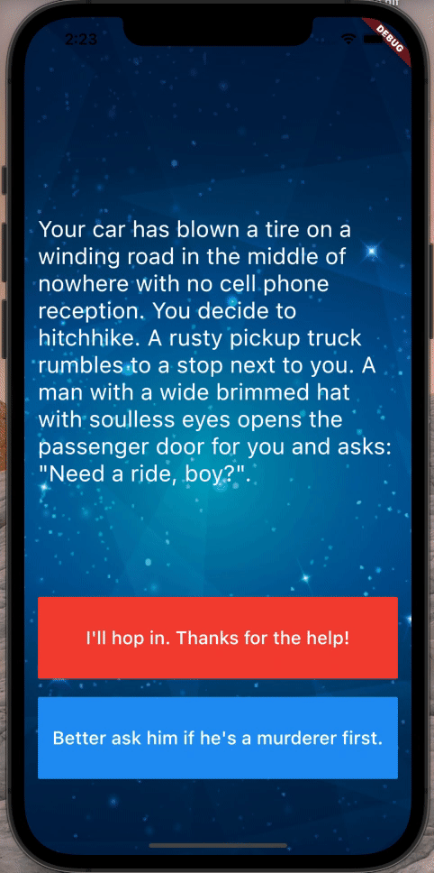

# Destini

## Goal
Object Oriented Programming (OOP) - Classes and Objects - exercise.

## The App
App that allows you to build the story according to your choices.

## Features
- Object oriented application;
- Stateless widgets designing the user interface;
- Stateful widgets updating the user interface;
- onClick Listeners;
